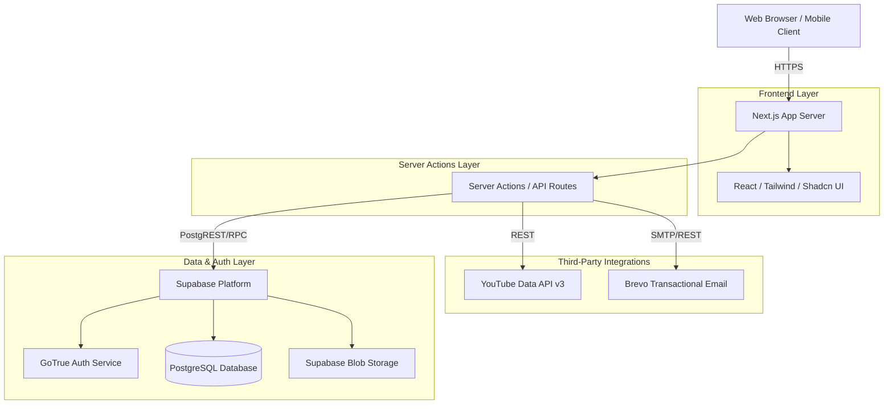
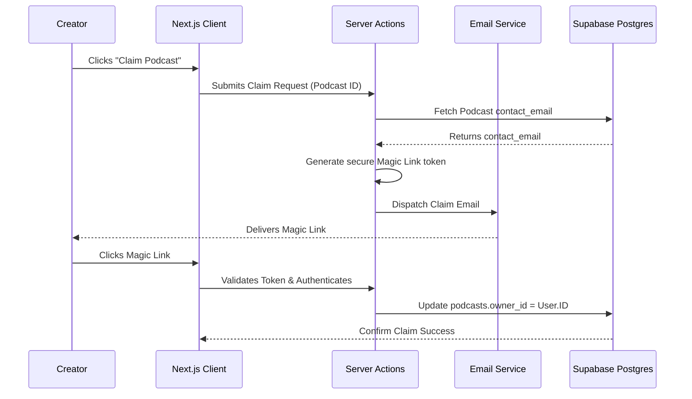
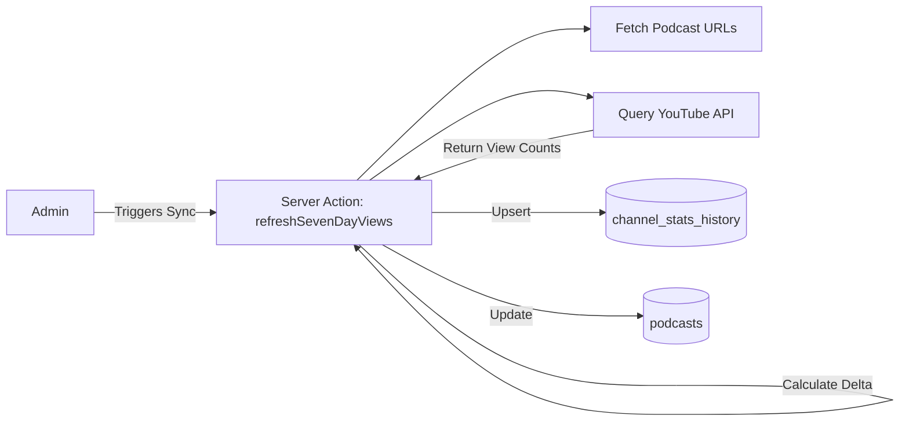

# dpnranker.com - Technical Reference Manual

---

## 1. Document Information

| **Property** | **Details** |
| :--- | :--- |
| **Product Name** | dpnranker.com (Dentsu Podcast Network Ranker) |
| **Version** | 1.0 |
| **Document Date** | June 25, 2026 |
| **Owner** | Dentsu Podcast Network |
| **Purpose** | Official technical reference, architectural baseline, and security implementation guide. |
| **Intended Audience** | AI & InfoSec, Compliance, and Audit Stakeholders |

### Revision History

| **Version** | **Date** | **Author** | **Description** |
| :--- | :--- | :--- | :--- |
| 1.0 | 2026-06-25 | Dentsu Podcast Network | Initial baseline version representing the production deployment architecture. |

---

## 2. Executive Summary

**dpnranker.com** is a proprietary web application developed for the Dentsu Podcast Network. It serves as a centralized creator marketplace and algorithmic podcast ranking index.

### Business Purpose
The platform connects brands, agencies, and podcast creators by aggregating real-time analytics. It replaces fragmented data collection with a unified, transparent, and algorithmic "DPN Score" that normalizes audience penetration against engagement vectors. This empowers advertisers to make data-driven media investments while giving creators a platform to showcase their verified analytics.

### Core Capabilities
- **Algorithmic Ranking Engine:** Synthesizes logarithmic scaling of 7-day cumulative YouTube audience penetration with relative engagement density vectors.
- **Creator Management:** Automated onboarding workflows allowing creators to securely claim their indexed podcasts via Magic Link verification.
- **Agency Portal:** Dedicated interfaces for media buyers and agency representatives to explore verified podcast inventory.
- **Admin Orchestration:** Centralized Super Admin controls to seed new podcasts, manage rankings, enforce data integrity, and dictate feature flags.

---

## 3. System Architecture

The application employs a decoupled, serverless-oriented architecture leveraging Next.js (App Router) backed by Supabase (PostgreSQL + Auth).



### Deployment Architecture
The application is currently containerized and deployed via PM2 on a managed Ubuntu VPS (Hostinger), utilizing Nginx as a reverse proxy with SSL termination.

---

## 4. Technology Stack

| Technology | Category | Purpose | Integration Profile |
| :--- | :--- | :--- | :--- |
| **Next.js (v14+)** | Framework | Full-stack React framework utilizing App Router. | Handles all routing, SSR/SSG rendering, and Server Actions for secure backend execution. |
| **React** | UI Library | Component-based UI rendering. | Powers the client-side interactivity and state management. |
| **Tailwind CSS** | Styling | Utility-first CSS framework. | Enables rapid, consistent, and responsive styling across the platform. |
| **Shadcn UI** | UI Components | Accessible, customizable component primitives. | Provides the baseline design system (buttons, modals, tooltips) ensuring UI consistency. |
| **Supabase** | Backend-as-a-Service | Database, Auth, and Storage. | Core data layer; utilizes PostgreSQL with Row Level Security (RLS) to enforce data boundaries. |
| **YouTube API v3** | External API | Data ingestion and analytics tracking. | Fetches live subscriber counts, views, latest video URLs, and topic categories for algorithmic scoring. |
| **Brevo** | Email Service | Transactional email orchestration. | Delivers secure Magic Links and administrative invites. |
| **PM2** | Process Manager | Production process orchestration. | Ensures the Next.js Node process runs continuously on the Hostinger VPS with automatic restarts. |

> [!NOTE]
> Supabase is utilized as a hosted PaaS, offloading database maintenance, real-time socket management, and authentication infrastructure to a specialized provider.

---

## 5. Functional Modules

### 5.1. The Ranker Engine
- **Purpose:** Calculates and displays the proprietary DPN Score.
- **Inputs:** YouTube Subscriber Count, Total Views, Total Videos, Views (Last 7 Days).
- **Business Logic:** Applies a proprietary, non-linear algorithmic matrix to generate a normalized index.
- **Dependencies:** YouTube API, Postgres `podcasts` table, Postgres `channel_stats_history` table.

### 5.2. Identity & Access Management (IAM)
- **Purpose:** Manages user registration, role assignment, and access controls.
- **Inputs:** OAuth tokens, Email/Password, Magic Link tokens.
- **Business Logic:** Maps authenticated sessions to `profiles.role` (e.g., `creator`, `agency_user`, `super_admin`). Restricts UI elements and server actions based on these roles.
- **Dependencies:** Supabase GoTrue.

### 5.3. Admin Orchestration Console
- **Purpose:** Empowers administrators to manage the platform without direct database access.
- **Business Logic:** Allows admins to seed podcasts via YouTube URLs, manually override genres, revoke unauthorized claims, and manually trigger 7-day stat recalculations.
- **Security:** Protected by strict `getAdminUser()` server-side validations utilizing the `SERVICE_ROLE_KEY` to bypass standard RLS when performing global administrative tasks.

---

## 6. Process Flows

### Creator Claim Workflow
This is a critical security workflow designed to prevent Insecure Direct Object Reference (IDOR) takeovers of podcast profiles.



### YouTube Data Synchronization


---

## 7. API Documentation

### Internal Server Actions (Next.js)
The application relies heavily on Next.js Server Actions rather than traditional REST endpoints. 
- `adminSeedPodcast(youtubeUrl)`: Fetches YouTube channel statistics and inserts a new seeded record.
- `refreshSevenDayViews()`: Iterates over all approved podcasts to fetch current metrics and calculate the 7-day delta.
- `updatePodcastGenre(id, newGenre)`: Updates the canonical genre using standardized dropdown values.

### External API Usage: YouTube Data API v3
- **Endpoints Used:** `/channels`, `/playlistItems`, `/videos`
- **Rate Limits:** Bounded by Google Cloud Quotas (default 10,000 units/day).
- **Error Handling:** Graceful fallbacks implemented. If the API fails or rate limits are hit, the application retains the most recent valid snapshot.

---

## 8. Database Design

The database is built on **PostgreSQL**, hosted via Supabase.

### Core Entity-Relationship Model
- **`profiles`**: Extends the `auth.users` table. Contains `role`, `full_name`, and `company`.
- **`podcasts`**: The primary entity. Contains statistics, URLs, metadata, and algorithmic inputs. Linked to `profiles.id` via `owner_id`.
- **`channel_stats_history`**: Time-series table logging daily snapshots of `total_views` and `subscriber_count` for trend analysis.
- **`agencies`**: Stores agency profiles and verification status.

> [!TIP]
> The `channel_stats_history` table utilizes a unique constraint on `(podcast_id, recorded_date)` to facilitate idempotency via `upsert` operations.

---

## 9. Security Architecture

The platform was engineered with a security-first posture, anticipating modern threat vectors.

### 9.1. Access Control & IAM
- **Authentication:** Managed entirely by Supabase Auth (GoTrue), ensuring industry-standard hashing, session management, and JWT signing.
- **Row Level Security (RLS):** Enabled on all Postgres tables. Database policies explicitly define read/write permissions based on `auth.uid()`.
- **Server-Side Authorization:** Next.js Server Actions re-verify permissions utilizing a rigorous `getAdminUser()` utility before processing administrative state mutations.

### 9.2. Protection Against Common Threats
| Threat Vector | Mitigation Strategy |
| :--- | :--- |
| **SQL Injection** | Nullified via Supabase ORM/PostgREST which natively parameterizes all database queries. |
| **XSS (Cross-Site Scripting)** | React inherently escapes dynamic content rendering. Unsafe raw HTML injection (`dangerouslySetInnerHTML`) is strictly prohibited. |
| **CSRF (Cross-Site Request Forgery)** | Next.js Server Actions implement native Origin validation and anti-CSRF tokens. |
| **IDOR / Privilege Escalation** | Ownership mutations (e.g., claiming a podcast) require out-of-band verification (Magic Link sent to the canonical channel email). Server actions explicitly validate the requesting user's `owner_id`. |
| **Secrets Leakage** | Critical tokens (`SUPABASE_SERVICE_ROLE_KEY`, `YOUTUBE_API_KEY`) are isolated to server-side environments and never exposed to the client bundle (`NEXT_PUBLIC_` prefix is strictly avoided for sensitive keys). |
| **DDoS & Spam (Feature Abuse)** | In-memory IP-based rate limiting is enforced on sensitive forms (e.g., `switchUserCategory` for creator applications) to prevent automated spam and exhaustion. |
| **Clickjacking & MIME-Sniffing** | `next.config.ts` enforces `X-Frame-Options: DENY`, `X-Content-Type-Options: nosniff`, and `Strict-Transport-Security` headers on all responses. |

> [!CAUTION]
> **RLS Bypass Note:** Administrative functions purposefully utilize the Supabase `SERVICE_ROLE_KEY` to bypass Row Level Security. This is a design requirement for global admin actions. The security of this bypass relies entirely on the integrity of the `getAdminUser()` check at the entry point of the server action.

---

## 10. Privacy & Compliance

### DPDP Act (2023) Considerations
The platform adheres to the principles of India's Digital Personal Data Protection Act (2023):
- **Data Minimization:** We collect only essential personal data explicitly required to facilitate B2B portal functionality.
- **Consent Management:** Through our Creator and Agency signup forms, users are presented with clear opt-in requirements. Users provide express consent prior to sharing any personal or corporate information onto the platform.
- **Purpose Limitation:** Information collected through verified opt-ins is used strictly for platform services (such as matchmaking creators with agencies) and is not repurposed or sold to non-participating third parties.

---

## 11. Reliability & Operations

- **Hosting Environment:** Ubuntu VPS via Hostinger.
- **Process Management:** `pm2` ensures process persistence and automatic restarts on crash.
- **Data Backups:** Handled natively by the Supabase platform (Point-in-Time Recovery enabled based on project tier).
- **Graceful Degradation:** If the YouTube API experiences an outage, the platform gracefully degrades by displaying the last known cached metrics rather than returning 500 errors to the client.

---

## 12. Deployment

**Current Deployment Pipeline (Manual/Scripted):**
1. Code is versioned in GitHub.
2. Administrator SSH access into the Hostinger VPS.
3. Execution of the deployment script:
   ```bash
   cd /root/dpn-ranker
   git pull
   npm run build
   pm2 restart dpnranker
   ```

> [!IMPORTANT]
> This manual CI/CD pipeline is sufficient for v1.0 but may transition to automated GitHub Actions in future iterations to enforce testing gates before deployment.

---

## 13. Risks & Assumptions

### Technical Assumptions
- **YouTube API Stability:** The algorithmic engine assumes the YouTube API schema and quota availability will remain consistent.
- **Single Node Deployment:** The Next.js application runs on a single VPS. It assumes traffic patterns will remain within the vertical scaling limits of the instance.

### Potential Risks
- **Rate Limiting Exposure:** Server Actions currently lack strict IP-based rate limiting. Malicious actors could theoretically trigger API exhaustion if public endpoints (like `adminSeedPodcast`) are abused, though this is mitigated by admin auth gates.

---

## 14. Feature Update Log

**Version:** 1.0
**Release Date:** June 25, 2026
**Summary:** Baseline Production Release

**New Features**
- Initial deployment of algorithmic Ranker Engine.
- Secure Creator Claim workflow via Magic Link.
- Super Admin orchestration dashboard.

**Enhancements**
- Standardized canonical genre dropdowns across all creator, agency, and admin portals.

**Security Improvements**
- Implementation of out-of-band email verification to prevent IDOR attacks during podcast claiming.
- Strict Role-Based Access Control (RBAC) enforced on all server actions.

**Infrastructure Changes**
- PM2 production deployment on Hostinger VPS.
- Supabase integration configured for Auth and Database persistence.
